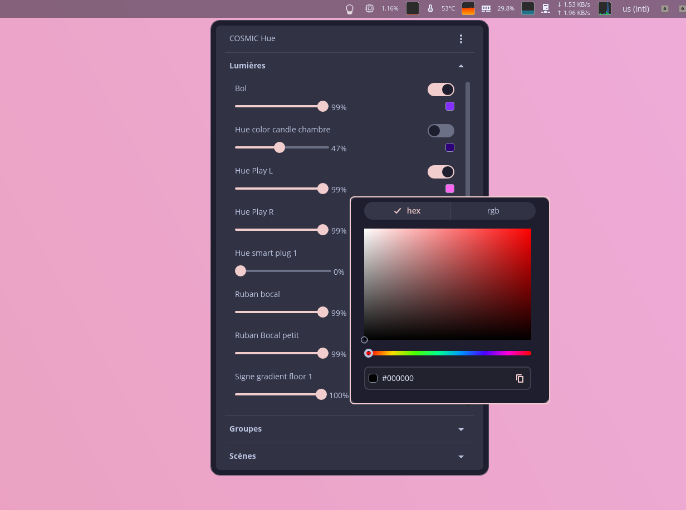
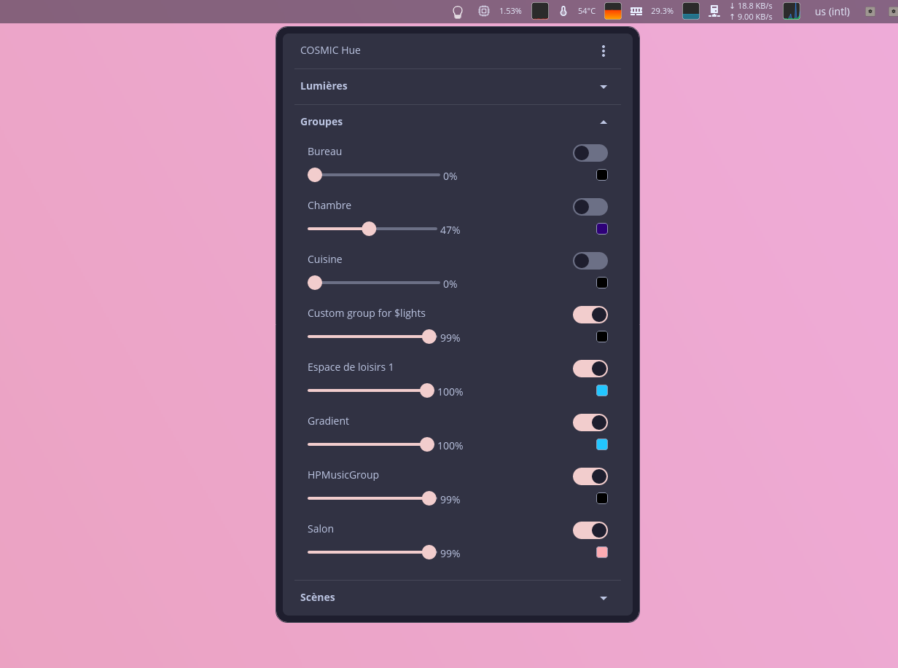
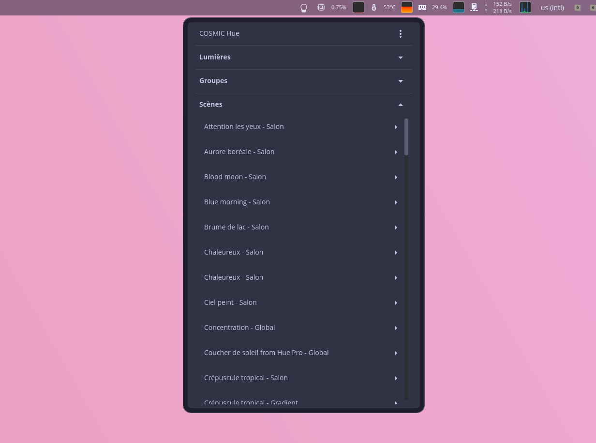

# COSMIC Hue

A COSMIC™ desktop applet for managing Philips Hue lights directly from your system tray. Built with [libcosmic][libcosmic] and [huelib][huelib] for native Rust integration with the Philips Hue ecosystem.

This repository has been made with the [COSMIC applet template][COSMIC applet template].

## Features

- Automatic discovery of Philips Hue bridges on your network
- Control lights: on/off, brightness, and color
- Manage groups to control multiple lights together
- Quick access to your Hue scenes
- Integrated color picker
- Multi-language support (English, French)

## Screenshots

<details>
<summary>Click to view screenshots</summary>

<p align="center">
  
  <br><em>Lights View</em>
</p>

<p align="center">
  
  <br><em>Groups View</em>
</p>

<p align="center">
  
  <br><em>Scenes View</em>
</p>

</details>

## Installation

```bash
git clone https://github.com/clockworksfr/cosmic-ext-applet-hue.git
cd cosmic-ext-applet-hue
just install
```

### Available Commands

The project uses [just][just] as command runner:

- `just` - Build the application (release mode)
- `just run` - Build and run the application
- `just install` - Install into the system
- `just check` - Run clippy for linter warnings
- `just vendor` - Create vendored tarball for packaging
- `just build-vendored` - Build with vendored dependencies

## Usage

1. Click the Cosmic Hue icon in your system tray
2. Click "Configure" to search for your Hue bridge
3. Press the physical button on your Hue bridge
4. Click "Pair bridge" to authenticate

Once configured, you can control your lights, groups, and scenes directly from the applet.

## Translations

[Fluent][fluent] is used for localization. Translation files are in the [i18n directory](./i18n).

To add a new language:
1. Copy the `i18n/en` directory to `i18n/XX` (where XX is the [ISO 639-1 language code][iso-codes])
2. Translate the strings in `cosmic_ext_applet_hue.ftl`
3. Untranslated messages will fall back to English

## Development

Install [rustup][rustup] and configure your editor to use [rust-analyzer][rust-analyzer]:

```bash
curl --proto '=https' --tlsv1.2 -sSf https://sh.rustup.rs | sh
cargo install just
just run
```

## License

Licensed under the GPL-3.0-only License.

[fluent]: https://projectfluent.org/
[iso-codes]: https://en.wikipedia.org/wiki/List_of_ISO_639-1_codes
[just]: https://github.com/casey/just
[rustup]: https://rustup.rs/
[rust-analyzer]: https://rust-analyzer.github.io/
[libcosmic]: https://github.com/pop-os/libcosmic
[huelib]: https://github.com/yuqio/huelib-rs
[COSMIC applet template]: https://github.com/pop-os/cosmic-applet-template
